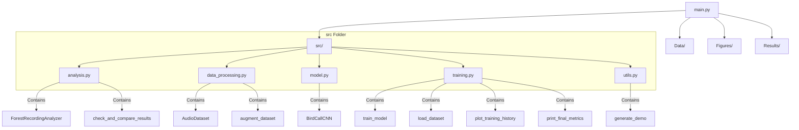

```mermaid
graph TD
    A[main.py]

    A --> B[Data/]
    A --> C[Figures/]
    A --> D[Results/]
    A --> E[src/]

    subgraph src Folder
        direction TB
        E --> F[analysis.py]
        E --> G[data_processing.py]
        E --> H[model.py]
        E --> I[training.py]
        E --> J[utils.py]
    end

    F --> |Contains| BFA[ForestRecordingAnalyzer]
    F --> |Contains| BFB[check_and_compare_results]

    G --> |Contains| CDA[AudioDataset]
    G --> |Contains| CDB[augment_dataset]

    H --> |Contains| DBM[BirdCallCNN]

    I --> |Contains| EFT[train_model]
    I --> |Contains| EFL[load_dataset]
    I --> |Contains| EFP[plot_training_history]
    I --> |Contains| EFM[print_final_metrics]

    J --> |Contains| FGD[generate_demo]
```
