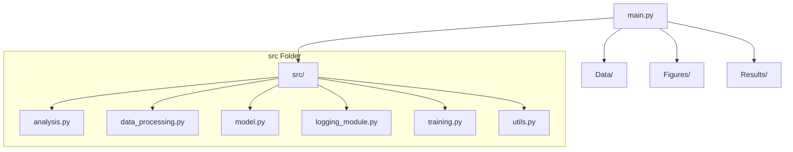
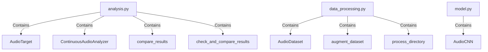
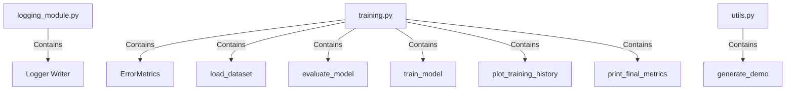

# Signal Separation and Classification in Noisy Environments with Machine Learning

## Abstract

This project investigates machine learning techniques for signal separation and classification within noisy environments, inspired by traditional matched filtering methods used in radar signal processing. The goal is to train a machine learning model to identify, separate, and classify specific signals within noisy, continuous data. This work has potential applications in fields requiring robust signal processing, such as radar systems, radio frequency (RF) communication, and general digital signal processing.

## Project Structure

The project is organized as follows:







## How to Run the Project

The project is executed through the `main.py` file, which provides a command-line interface for various functionalities. It uses `argparse` to accept arguments for different modes and parameters.

### Command-Line Arguments

| Argument          | Description                                                        |
| ----------------- | ------------------------------------------------------------------ |
| `--mode`          | Specifies the mode of operation. Choices are:                      |
|                   | - `1`: Full Pipeline (train and analyze)                           |
|                   | - `2`: Training Only                                               |
|                   | - `3`: Analysis Only                                               |
|                   | - `4`: Generate Demo Figures                                       |
|                   |                                                                    |
| `--epochs`        | Number of training epochs (default: 50).                           |
|                   |                                                                    |
| `--learning_rate` | Learning rate for training (default: 0.001).                       |
|                   |                                                                    |
| `--augment`       | Use augmented dataset (`T` for True, `F` for False; default: `T`). |

### Example Commands

1. **Run the Full Pipeline with Default Values**:

   ```bash
   python main.py
   ```

2. **Run Training Only with 100 Epochs and 0.005 Learning Rate**:

   ```bash
   python main.py --mode 2 --epochs 100 --learning_rate 0.005
   ```

3. **Run Analysis Only**:
   ```bash
   python main.py --mode 3
   ```
